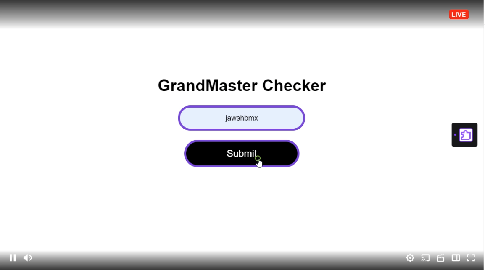
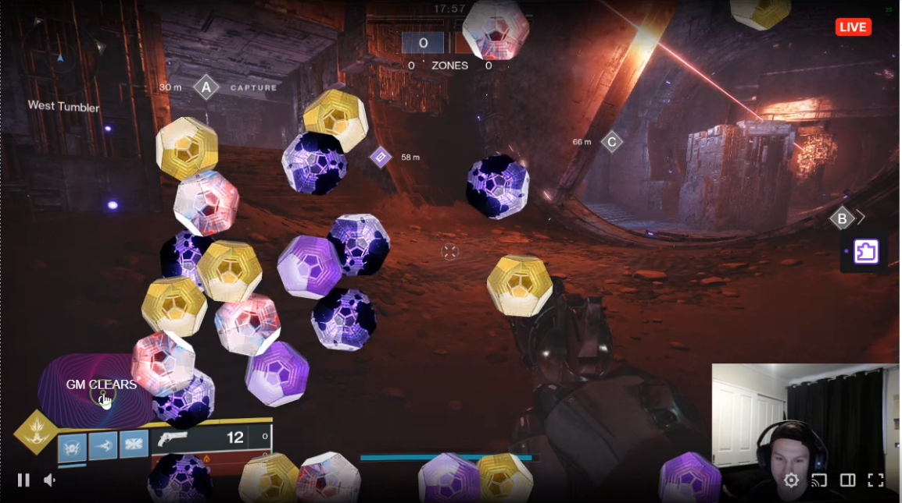
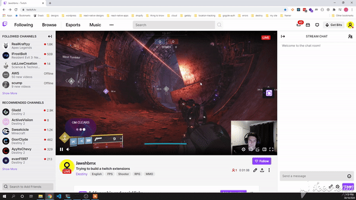
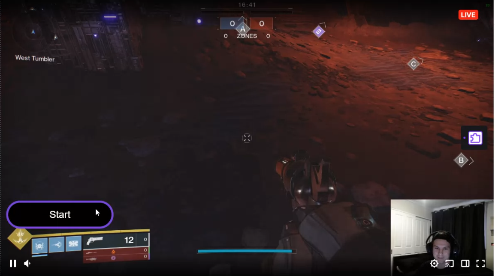

# Twitch overlay rebuild

# Todos

Server

- [x] Setup express server
- [ ] Setup middleware if needed
- [x] Learn how socket.io works or websockets
- [x] Figure out Destiny End points
- [x] Users : Endpoints
- [x] Loop over users
- [x] Activites : Endpoints
- [x] Use node-cron to hit endpoints everything min/hour
- [ ] Cache of some sort
- [ ] docker maybe for scale ?
- [ ] update client on connection

client

- [x] Twitch extension full screen overlay
- [X] Setup socket.io connection
- [X] Animtion on updated data
- [ ] Change login to config page
- [ ] reszie canvas 
- [X] Show different overlay for users and broadcaster

Screenshots

Streamer View

Client

